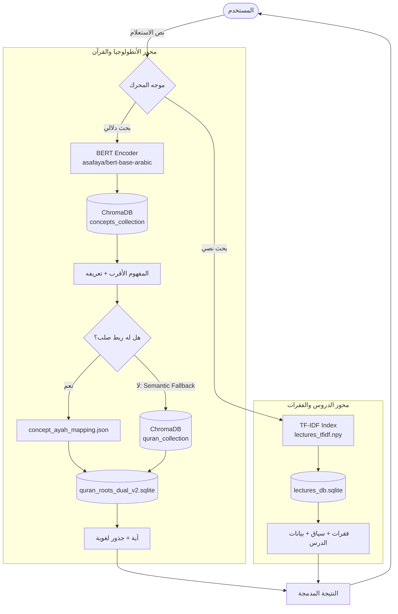

# 📖 منظومة HUSSAIN المعرفية
**Hybrid Unified System for Semantic Islamic ANalysis**

> **حالة المشروع:** إنتاجي ✅ | **آخر تحديث:** 2026-03-30

---

## ⚡ الإعداد السريع (Quick Setup)

### 1️⃣ استنساخ المستودع
```bash
git clone https://github.com/YOUR_USERNAME/hussain-knowledge.git
cd hussain-knowledge
```

### 2️⃣ تثبيت المتطلبات
```bash
pip install -r requirements.txt
```

### 3️⃣ تنزيل قواعد البيانات

> [!IMPORTANT]
> قواعد البيانات **لا تُرفع في المستودع** لكبر حجمها — قم بتنزيلها يدوياً وضعها في مجلد المشروع.

| الملف | الحجم | رابط التنزيل |
|---|---|---|
| `lectures_db.sqlite` | ~17.6 MB | [📥 تنزيل من Google Drive](https://drive.google.com/file/d/1fbK37yxz5yGibDwp6hk_X0Mx8QLA8_6U/view?usp=sharing) |
| `quran_roots_dual_v2.sqlite` | ~15.2 MB | [📥 تنزيل من Google Drive](https://drive.google.com/file/d/1tqqcj6v4DDLfVv7nXEmsit2IyD2XeHXg/view?usp=sharing) |

### 4️⃣ بناء فهرس البحث
```bash
# يُولّد ملف lectures_tfidf.npy (يستغرق 5-15 دقيقة)
python lectures_indexer.py
```

### ✅ أو استخدم سكريبت الإعداد التلقائي
```bash
python setup.py
```
> يتحقق من جميع الملفات ويبني الفهرس تلقائياً إذا لم يكن موجوداً.

---

## 📂 التوثيق التقني (Technical Documentation)

للحصول على تفاصيل برمجية وهيكلية عميقة، يرجى مراجعة **[حزمة توثيق الباك اند](docs/BACKEND_OVERVIEW.md)** التي تشمل:
- [🏛️ بنية النظام والمسارات](docs/BACKEND_OVERVIEW.md)
- [📖 هندسة البيانات والمعالجة](docs/DATA_PIPELINE.md)
- [🔍 محركات البحث والاستعلام](docs/SEARCH_ENGINE.md)
- [🗄️ مرجع قاعدة البيانات](docs/DATABASE_REFERENCE.md)

---

## 1. الرؤية والأهداف

### 1.1 ما هو مشروع HUSSAIN؟

**HUSSAIN** منظومة معرفية متكاملة تهدف إلى بناء جسر حاسوبي بين **التراث الفكري للسيد حسين بدر الدين الحوثي** والـ**نص القرآني الكريم**. المشروع يحوّل المئات من الدروس والمحاضرات النصية إلى قاعدة معرفية قابلة للبحث والاستعلام الدلالي.

**المحرك الجوهري:** نظام بحث هجين يربط:
- **الأنطولوجيا الفلسفية** (المفاهيم المستخرجة من الدروس)
- **النص القرآني وجذوره اللغوية** (6236 آية مع جذورها الصرفية)
- **فقرات الدروس الخام** (11,883 فقرة عبر 86 درساً)

### 1.2 التطور التاريخي

```
المرحلة 1 → ملفات JSON خام (مفاهيم مجزأة)
المرحلة 2 → محرك بحث هجين (Semantic + Lexical)
المرحلة 3 → أنطولوجيا موحدة (unified_ontology.ttl)
المرحلة 4 ✅ → قاعدة دروس منظمة + فهرسة دلالية عربية
```

---

## 2. المعمارية التقنية الشاملة

### 2.1 مخطط تدفق محرك البحث الهجين



### 2.2 مبدأ التوجيه الذاتي (Self-Routing)

محرك HUSSAIN لا يُلزم المستخدم بتحديد مصدر البحث. يقرر المحرك ذاتياً:

| المسار | الشرط | الآلية |
|--------|--------|--------|
| **Hard-Link** | المفهوم له ربط مباشر بآية | `concept_ayah_mapping.json` — فوري |
| **Semantic Fallback** | لا ربط مباشر | BERT → ChromaDB → أقرب آية |
| **Lectures Search** | البحث في فقرات الدروس | TF-IDF Cosine Similarity |

---

## 3. وحدة الدروس (Lectures Module)

> [!IMPORTANT]
> هذه الوحدة هي المرحلة الرابعة من تطور المشروع — أضافت **11,883 فقرة** من 86 درساً موزعة على 7 سلاسل.

### 3.1 خط أنابيب معالجة الدروس

```
ملف .txt خام
    ↓
[lecture_parser.py] — تحليل الترميز + استخراج البيانات الوصفية
    ↓
[lectures_manager.py] — توليد UUID + كشف ازدواجية + إدراج
    ↓
[lectures_db.sqlite] — تخزين منظم في 4 جداول
    ↓
[lectures_indexer.py] — بناء مصفوفة TF-IDF
    ↓
[lectures_tfidf.npy] — فهرس البحث الدلالي
    ↓
[lectures_query.py] — واجهة الاستعلام
```

### 3.2 محلل الدروس النصية (`lecture_parser.py`)

**المشكلة التقنية:** ملفات الدروس محفوظة بترميزات مختلطة (UTF-16LE, UTF-8, Windows-1256).

**الحل المُطبَّق:**
```python
# خوارزمية guess_encoding — تجريب تسلسلي
encodings = ['utf-16le', 'utf-8', 'windows-1256', 'cp1256']
```

**مبادئ التحليل الثابتة:**
- ✅ **حفظ النص الأصلي** بدون أي تنظيف أو تعديل
- ✅ **فصل الفقرات** بمعيار `\n` (السطر الجديد) فقط
- ✅ **كشف الآيات** تلقائياً عبر الأقواس `{...}` و`((...))` → `contains_ayat = True`
- ✅ **استخراج ترويسة** الدرس: السلسلة، العنوان، المتحدث، التاريخ، الموقع

### 3.3 هيكل قاعدة الدروس (`lectures_db.sqlite`)

```sql
-- 4 جداول مترابطة بعلاقات Foreign Key

series          -- السلاسل (7 سلاسل)
    └── lectures        -- الدروس (86 درساً)
            ├── paragraphs           -- الفقرات (11,883 فقرة)
            ├── lecture_sections      -- الأقسام الموضوعية (576 قسماً)
            │       └── section_ayah_refs -- إشارات الآيات لكل قسم (1659 إشارة)
            └── lecture_extra_metadata -- بيانات وصفية إضافية (تاريخ، مكان، نطاق)
```

**تفاصيل الجداول الجديدة (نظام الأقسام):**

| الجدول | الوصف | الحقول الرئيسية |
|--------|-------|-----------------|
| `lecture_sections` | التقسيم الموضوعي التحليلي للدرس | section_title, section_summary, start_paragraph_id, tags |
| `section_ayah_refs` | الآيات المستشهد بها في كل قسم | surah_name, ayah_number, section_id |
| `lecture_extra_metadata` | بيانات سياقية للدرس | date_hijri, date_gregorian, location, ayah_range |

**فهارس SQL المضافة للسرعة:**
```sql
idx_sections_lecture      -- جلب أقسام درس معين
idx_ayah_refs_section     -- جلب آيات قسم معين
idx_extra_meta_lecture    -- جلب بيانات الدرس الإضافية
```

### 3.4 إحصائيات قاعدة الدروس الحالية

| السلسلة | عدد الدروس | ملاحظة |
|---------|-----------|--------|
| دروس آيات من آل عمران | 4 | |
| دروس من سورة المائدة | 4 | |
| سلسلة دروس رمضان | 26 | |
| متفرقات | 23 | |
| محاضرات المدرسة | 7 | |
| مديح القرآن | 7 | يشمل الدروس 5-6-7 المضافة |
| معرفة الله | 15 | |
| **الإجمالي** | **86 درس / 11,883 فقرة** | |

### 3.5 الفهرسة الدلالية (`lectures_indexer.py` + `lectures_tfidf.npy`)

**التقنية:** TF-IDF + Cosine Similarity عبر `numpy` — مختار خصيصاً لعدم توافر PyTorch في بيئة التشغيل.

**خطوات بناء الفهرس:**
1. تطبيع النصوص العربية (إزالة التشكيل، توحيد الهمزات، توحيد التاء المربوطة)
2. بناء قاموس المفردات (61,586 كلمة فريدة من 11,883 فقرة)
3. حساب مصفوفة TF-IDF (11,431 × 61,586) مع L2 Normalization
4. حفظ المصفوفة في `lectures_tfidf.npy` (حجم ~2.7 GB)
5. حفظ القاموس ومعرفات الفقرات في `lectures_db.sqlite` (جدول `search_index`)

---

## 4. واجهات الاستعلام

### 4.1 المحرك الهجين (`hybrid_search.py`)

```python
from hybrid_search import HybridSearchEngine

engine = HybridSearchEngine()
engine.index_concepts()   # فهرسة الأنطولوجيا (مرة واحدة)
engine.index_quran()      # فهرسة القرآن 6236 آية (مرة واحدة)

engine.search("الخسارة الحقيقية للإنسان", top_k=2)
```

**دالة `search()` — التدفق الداخلي:**
1. تضمين الاستعلام عبر BERT → ChromaDB Concepts → أقرب مفهوم
2. فحص `concept_ayah_mapping.json`:
   - إذا وُجد ربط: جلب الآية مباشرة من SQLite
   - إذا لم يوجد: Semantic Fallback → ChromaDB Quran → أقرب آيتين
3. جلب الجذور اللغوية من `quran_roots_dual_v2.sqlite`

### 4.2 بحث الدروس (`lectures_query.py`)

```python
from lectures_query import search_paragraphs, get_paragraph_by_id, get_paragraph_context

# بحث دلالي في 11,883 فقرة
results = search_paragraphs("طاعة أهل الكتاب وخطر الكفر", top_k=5)
# → [{"paragraph_id", "score", "content", "lecture_title", "series_title", ...}]

# جلب فقرة بمعرّفها المباشر
paragraph = get_paragraph_by_id("394baa71-4854-4c90-9726-68a4411c2855")

# جلب السياق المحيط (الفقرة + 2 قبلها + 2 بعدها)
context = get_paragraph_context("394baa71-...", surrounding=2)
```

### 4.3 تصدير الدروس (`export_lectures_to_json.py`)

```python
# تصدير درس واحد
run_export(single_lecture_id="uuid-هنا")

# تصدير الكل
run_export()
```

**المخرج:** مجلد `lectures_json_export/` — 7 مجلدات فرعية، كل مجلد لسلسلة، كل ملف JSON للدرس:

```json
{
  "lecture_id": "uuid",
  "metadata": {
    "title": "سورة آل عمران ـ الدرس الأول",
    "speaker": "حسين بدر الدين الحوثي",
    "date": "...",
    "series": { "title": "دروس آيات من آل عمران" }
  },
  "statistics": { "total_paragraphs": 127, "paragraphs_with_ayat": 45 },
  "paragraphs": [
    { "paragraph_id": "uuid", "sequence_index": 1, "content": "...", "contains_ayat": false }
  ]
}
```

---

## 5. قواعد البيانات — المرجع الكامل

### 5.1 `lectures_db.sqlite` — قاعدة الدروس

| الخاصية | القيمة |
|---------|--------|
| الحجم | ~16.7 MB |
| عدد الجداول | 5 (4 رئيسية + search_index) |
| المعرفات | UUID4 لكل كيان |
| الترميز | UTF-8 |

### 5.2 `quran_roots_dual_v2.sqlite` — قاعدة القرآن

| الخاصية | القيمة |
|---------|--------|
| الحجم | ~15.6 MB |
| الآيات | 6236 آية |
| الجداول الرئيسية | `ayah` (text_uthmani, text_plain) + `token` (root) |
| الاستخدام | `get_ayah_details(global_ayah)` في `hybrid_search.py` |

### 5.3 `unified_ontology.ttl` — الأنطولوجيا

| الخاصية | القيمة |
|---------|--------|
| الصيغة | Turtle (RDF/OWL) |
| الحجم | ~3.3 MB |
| المحتوى | مفاهيم فلسفية + علاقاتها الهرمية |
| الاستخدام | مصدر فهرسة `concepts_collection` في ChromaDB |

---

## 6. دليل المطور (Developer Guide)

### 6.1 إعداد البيئة

المشروع يستخدم **Python Embedded** (بيئة محلية في `python-embed/`) لا تحتاج تثبيتاً إضافياً.

```powershell
# تشغيل أي سكربت
.\python-embed\python.exe hybrid_search.py
.\python-embed\python.exe lectures_query.py
.\python-embed\python.exe export_lectures_to_json.py
```

```bash
# في بيئة Python عادية
pip install -r requirements.txt
```

**محتوى `requirements.txt`:**
```
fastapi>=0.100.0
uvicorn>=0.23.0
chromadb>=0.4.0
sentence-transformers>=2.2.0
torch>=2.0.0
pydantic>=2.0.0
```

> [!WARNING]
> **تنبيه بيئة Windows:** `torch` و`onnxruntime` قد تُعاني من أخطاء DLL في بيئة python-embed. الوحدات التي لا تحتاجهما (`lectures_query`, `lectures_indexer`, `export_lectures_to_json`) تعمل بشكل كامل. `hybrid_search.py` يحتاج بيئة Python كاملة.

### 6.2 إضافة دروس جديدة

```python
from lectures_manager import LecturesManager

manager = LecturesManager()

# إضافة درس واحد
manager.process_lecture_file(r"المسار\إلى\الدرس.txt")

# إضافة مجلد كامل
manager.process_all_lectures(r"المسار\إلى\مجلد_الدروس")
```

> [!TIP]
> المدير يكتشف تلقائياً الدروس المضافة مسبقاً ويتخطاها (مكافحة الازدواجية).

### 6.3 إعادة بناء الفهرس الدلالي

```powershell
# مطلوب بعد كل إضافة دروس جديدة
.\python-embed\python.exe lectures_indexer.py
```

الفهرس يتحقق من وجود نسخة سابقة — لا يُعيد البناء إذا كانت الفقرات لم تتغير.

### 6.4 سير العمل الكامل لإضافة سلسلة جديدة

```
1. ضع ملفات .txt في مجلد جديد داخل Lectures Module/
2. شغّل lectures_manager.py → process_all_lectures()
3. شغّل lectures_indexer.py   ← إعادة بناء الفهرس
4. شغّل export_lectures_to_json.py  ← تحديث JSON
5. (اختياري) شغّل lectures_query.py لاختبار البحث
```

---

## 7. هيكل الملفات النهائي

```
📁 منظومة معرفية/
│
├── ── المحاور الإنتاجية ──────────────────────────────────
│
├── 📄 hybrid_search.py          ← محرك البحث الهجين (HUSSAIN Core)
├── 📄 lecture_parser.py         ← محلل ملفات الدروس النصية
├── 📄 lectures_db_setup.py      ← تهيئة قاعدة الدروس (الأساسية)
├── 📄 sections_db_setup.py      ← تهيئة جداول الأقسام الموضوعية (3 جداول)
├── 📄 sections_importer.py      ← استيراد الأقسام من JSON
├── 📄 lectures_manager.py       ← إدارة الدروس + Batch Processing
├── 📄 lectures_indexer.py       ← بناء فهرس TF-IDF الدلالي
├── 📄 lectures_query.py         ← واجهة البحث في الدروس
├── 📄 export_lectures_to_json.py ← تصدير الدروس إلى JSON
│
├── ── قواعد البيانات والفهارس ───────────────────────────
│
├── 💾 lectures_db.sqlite         ← قاعدة الدروس (86 درس، 11,883 فقرة، 576 قسماً)
├── 💾 quran_roots_dual_v2.sqlite ← قاعدة القرآن (6236 آية + جذور)
├── 💾 lectures_tfidf.npy         ← فهرس TF-IDF (~2.7 GB)
├── 📄 unified_ontology.ttl       ← الأنطولوجيا المعرفية (Turtle/OWL)
├── 📄 concept_ayah_mapping.json  ← خريطة الربط الصلب (مفاهيم ↔ آيات)
│
├── ── البنية التحتية ───────────────────────────────────
│
├── 📄 requirements.txt
├── 📄 README.md                  ← هذا الملف
├── 📄 PROJECT_WALKTHROUGH.md     ← توثيق الإنجازات الأخيرة
│
├── 📁 أقسام الدروس/              ← مصدر بيانات الأقسام الموضوعية (63 ملف JSON)
├── 📁 Lectures Module/           ← المصدر الخام للدروس النصية
│   ├── دروس آيات من آل عمران/   (4 دروس)
│   ├── دروس من سورة المائدة/    (4 دروس)
│   ├── سلسلة دروس رمضان/        (26 درساً)
│   ├── متفرقات/                  (23 درساً)
│   ├── محاضرات المدرسة/          (7 دروس)
│   ├── مديح القرآن/             (4 دروس — الدروس 5-7 في archive)
│   └── معرفة الله/              (15 درساً)
│
├── 📁 lectures_json_export/      ← مخرجات JSON (7 مجلدات + manifest)
├── 📁 python-embed/              ← بيئة Python المحلية
├── 📁 ماركداون/                  ← محتوى إضافي
│
└── 📁 archive_v1/                ← الأرشيف (راجع ARCHIVE_INDEX.md)
```

---

## 8. خارطة الطريق المستقبلية

### المرحلة الخامسة — دمج المحورين (قريباً)

دمج `lectures_query.search_paragraphs()` في `hybrid_search.py` لتوحيد نتائج البحث من ثلاثة مصادر في استعلام واحد:

```
استعلام المستخدم
    ├── محور الأنطولوجيا → آيات قرآنية + جذور
    └── محور الدروس     → فقرات + سياق + درس
         → نتيجة مدمجة موحدة
```

### المرحلة السادسة — الربط التلقائي بالآيات

تفعيل جدول `paragraph_ayah_mapping` بربط تلقائي بين:
- الفقرات التي تحتوي على آيات (`contains_ayat = True`)
- الآيات المقابلة في `quran_roots_dual_v2.sqlite`

### المرحلة السابعة — واجهة API

```python
# FastAPI Endpoint المقترح
POST /api/v1/search
{
  "query": "طاعة أهل الكتاب",
  "sources": ["quran", "lectures", "ontology"],
  "top_k": 5
}
```

### التحديات التقنية المعلقة

> [!CAUTION]
> **مشكلة DLL في بيئة python-embed:** `torch` و`onnxruntime` لا يعملان حالياً. الحل المطبق: TF-IDF بديلاً عن BERT لفهرسة الدروس. الحل النهائي: ترقية إلى Python كاملة أو Docker.

> [!WARNING]
> **حجم الفهرس:** `lectures_tfidf.npy` (~2.7 GB) يُحمَّل كاملاً في الذاكرة RAM عند الاستعلام. للإنتاج: استبدال بـ Sparse Matrix أو Faiss Index.

---

## 9. قاموس المصطلحات

| المصطلح | التعريف |
|---------|---------|
| **Hard-Link** | ربط مباشر ومحدد مسبقاً بين مفهوم وآية في `concept_ayah_mapping.json` |
| **Semantic Fallback** | البحث التلقائي في القرآن كاملاً عند غياب الربط المباشر |
| **TF-IDF** | خوارزمية وزن الكلمات: تردد الكلمة × عكس تواترها في المجموعة |
| **UUID4** | معرّف فريد عالمي مولَّد عشوائياً لكل كيان في قاعدة البيانات |
| **contains_ayat** | علامة منطقية للفقرات التي تحتوي على آيات قرآنية بين أقواس |
| **sequence_index** | الرقم التسلسلي للفقرة داخل درسها (يبدأ من 1) |
| **Cosine Similarity** | قياس التشابه الزاوي بين متجهَي استعلام وفقرة (نطاقه 0-1) |
| **Batch Processing** | معالجة جميع الملفات دفعة واحدة عبر `process_all_lectures()` |

---

*مشروع منظومة HUSSAIN — بنية معرفية للتراث الإسلامي*
