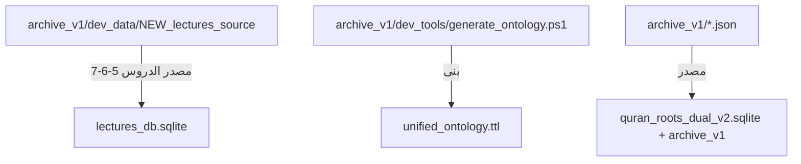

# 🗄️ دليل الأرشيف — مشروع منظومة HUSSAIN المعرفية

> آخر تحديث: 2026-03-30  
> المسار: `منظومة معرفية/archive_v1/`

---

## هيكلية الأرشيف

```
archive_v1/
├── dev_logs/          ← سجلات تشغيل وفحص منتهية
├── dev_scripts/       ← سكربتات اختبار وتطوير أولية
├── dev_data/          ← بيانات اختبار ومخرجات مؤقتة
├── dev_tools/         ← أدوات بناء وتوليد للمراجع
└── docs_archive/      ← وثائق قديمة أو سابقة
```

---

## 📁 `dev_logs/` — سجلات التشغيل

| الملف | المحتوى | تاريخ الأرشفة |
|-------|---------|--------------|
| `batch_log.txt` | سجل Batch Processing لمعالجة 82 درس | 2026-03-30 |
| `export_log.txt` | سجل تصدير الدروس إلى JSON | 2026-03-30 |
| `indexer_log.txt` | سجل بناء فهرس TF-IDF | 2026-03-30 |
| `fix_series_log.txt` | سجل إصلاح وتوحيد السلاسل (31→7) | 2026-03-30 |
| `folder_map.txt` | خريطة ربط ملفات الدروس بمجلداتها | 2026-03-30 |
| `meta_check.txt` | فحص بنية metadata_json | 2026-03-30 |
| `new_import_log.txt` | سجل استيراد دروس مديح القرآن 5-6-7 | 2026-03-30 |
| `new_preview.txt` | معاينة هيكل الملفات الجديدة (NEW) | 2026-03-30 |
| `new_preview2.txt` | معاينة موسعة للملفات الجديدة | 2026-03-30 |
| `pkg_check.txt` | فحص توفر مكتبات Python | 2026-03-30 |
| `query_log.txt` | سجل تشغيل اختبار البحث | 2026-03-30 |
| `rename_log.txt` | سجل إعادة تسمية الدروس 5/6/7 | 2026-03-30 |
| `series_check.txt` | فحص عدد السلاسل قبل الإصلاح | 2026-03-30 |
| `series_final.txt` | التحقق النهائي بعد توحيد السلاسل | 2026-03-30 |
| `test_output.txt` | ناتج اختبار سكربت الاستعلام | 2026-03-30 |
| `titles_check.txt` | التحقق من تحديث عناوين الدروس | 2026-03-30 |
| `update_log.txt` | سجل تحديث حقل title من original_file | 2026-03-30 |
| `ef_check.txt` | فحص Embedding Functions في ChromaDB | 2026-03-30 |

---

## 📁 `dev_scripts/` — سكربتات الاختبار والتطوير

| الملف | المحتوى | ملاحظة |
|-------|---------|--------|
| `test_parser.py` | المحلل النصي النموذجي الأولي | تطور إلى `lecture_parser.py` الإنتاجي |
| `test_lectures_db.py` | اختبار قراءة قاعدة البيانات وعرض إحصائياتها | يمكن إعادة توليده عند الحاجة |
| `sections_db_setup.py` | تهيئة جداول الأقسام الموضوعية الثلاثة | تم التنفيذ بنجاح |
| `lectures_db_setup.py` | تهيئة قاعدة بيانات الدروس الأساسية | تم التنفيذ بنجاح |
| `sections_importer.py` | سكربت استيراد الأقسام من JSON | المحرك الأساسي للاستيراد |
| `misc_sections_importer.py` | سكربت استيراد مخصص لسلسلة المتفرقات | استكمال التغطية 100% |
| `fix_ramadan_by_number.py` | إصلاح مطابقة دروس رمضان برقم الدرس | تجاوز مشكلة UUID المفقود |
| `surah_normalizer.py` | تطبيع أسماء السور (همزات، كشيدة) | لضمان الربط مع قاعدة القرآن |
| `db_audit.py` | سكربت التدقيق الشامل والتقرير الرقمي | أداة فحص الجودة |
| `check_misc.py` | فحص سريع لسلسلة المتفرقات | سكربت تشخيصي |
| `find_missing.py` | البحث عن الدروس المفقودة أو الناقصة | سكربت تشخيصي |
| `check_quran_schema.py` | فحص هيكلية قاعدة القرآن الكريم | سكربت تشخيصي |

---

## 📁 `dev_data/` — بيانات الاختبار والمؤقتة

| الملف/المجلد | المحتوى | ملاحظة |
|--------------|---------|--------|
| `sample_parsed_lecture.json` | عينة JSON لأول درس تم تحليله (آل عمران) | دليل على نجاح المرحلة التجريبية |
| `db_test_report.json` | تقرير اختبار قاعدة البيانات بعد الإدخال الأول | |
| `context_test_result.json` | نتيجة اختبار `get_paragraph_context()` | |
| `query_test_result.json` | نتيجة اختبار `search_paragraphs()` | |
| `lectures_manifest.json` | سجل جرد أولي للدروس (قبل إصلاح السلاسل) | النسخة الحالية في `lectures_json_export/` |
| `NEW_lectures_source/` | الملفات النصية الأصلية لدروس مديح القرآن 5-6-7 | **احتفظ بها** كمصدر أصلي |

---

## 📁 `dev_tools/` — أدوات البناء

| الملف | المحتوى | ملاحظة |
|-------|---------|--------|
| `generate_ontology.ps1` | سكربت PowerShell لبناء `unified_ontology.ttl` من JSON | **مرجعي** — قد يُحتاج إذا تم إعادة بناء الأنطولوجيا في المستقبل |

---

## 📁 الأرشيف القديم (موجود مسبقاً)

| الملف | المحتوى |
|-------|---------|
| `build_bridge.py` | سكربت بناء جسر قديم |
| `extract_names.py` | استخراج أسماء |
| `find_sakina.py` | بحث في المفاهيم |
| `get-pip.py` | مثبت pip |
| `inspect_db.py` | فحص قاعدة بيانات قديمة |
| `mock_search.py` | محرك بحث وهمي للاختبار |
| `print_5_examples.py` | طباعة أمثلة |
| `python-embed.zip` | نسخة احتياطية من بيئة Python |
| `سلسلة دروس شهر رمضان.json` | بيانات أنطولوجيا رمضان (أرشيف) |
| `سورة ال عمران.json` | بيانات أنطولوجيا آل عمران (أرشيف) |
| `مجموعة دروس - متفرقات.json` | بيانات أنطولوجيا متفرقات (أرشيف) |
| `مفاهيم سلسلة دروس مديح القرآن.json` | بيانات مديح القرآن (أرشيف) |
| `مفاهيم سلسلة دروس معرفة الله.json` | بيانات معرفة الله (أرشيف) |
| `مفاهيم سلسلة دروس من سورة المائدة.json` | بيانات المائدة (أرشيف) |
| `مفاهيم سلسلة ملازم المدرسة.json` | بيانات محاضرات المدرسة (أرشيف) |

---

## 🔗 علاقة الأرشيف بالمشروع الحالي



---

> [!NOTE]  
> جميع الملفات في الأرشيف محفوظة للمرجعية ولا تؤثر على تشغيل المشروع. المشروع الفعلي يعمل بالملفات الموجودة في جذر `منظومة معرفية/` فقط.
