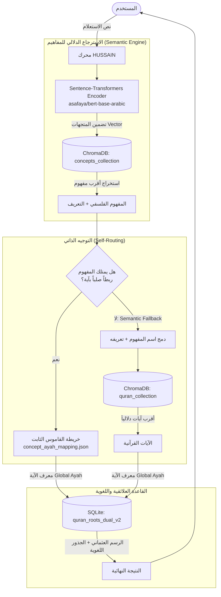

# 📖 الوثيقة المرجعية الشاملة لمحرك HUSSAIN
**(Hybrid Engine for Semantic Islamic Navigation)**

> [!NOTE]
> تُمثل هذه الوثيقة المرجعية الشاملة الدليل التقني والمعرفي المعتمد لمحرك **HUSSAIN**. تم إعدادها لتكون مرجعاً للمطورين والباحثين ومهندسي البيانات لفهم بنية المشروع وتطويره مستقبلاً.

---

## 1. الإطار النظري والفلسفي (Theoretical Framework)

### المنطلقات المعرفية
ينطلق المشروع أساساً من استيعاب ورقمنة **"المنظومة المعرفية لمفاهيم السيد حسين بدر الدين الحوثي"**. يتحول هذا الطرح من مجرد نصوص مقروءة إلى هيكل بيانات متصل يمكن للآلة استيعابه، مما يتيح استرجاع المعرفة القرآنية وفقاً للمقصد الدلالي الواسع للمفاهيم لا مجرد التطابق اللفظي.

### الأنطولوجيا الفلسفية وتبويب المفاهيم
الأنطولوجيا هنا ليست مجرد قاعدة بيانات، بل هي **شبكة دلالية مترابطة** تحدد ماهية المفهوم، وخصائصه، وعلاقاته بالمفاهيم الأخرى. تم تفكيك الدروس واستخلاص المفاهيم العميقة منها، ثم إعادة تركيبها في هيكل شجري أو شبكي يسمح بتعقب الروابط المنطقية بين الفكرة وأصلها.

### الأساس المنهجي للربط اللغوي والدلالي
> [!IMPORTANT]
> **لماذا الدمج بين الدلالة واللغة؟**
> يعتمد المعنى القرآني على بُعدين: الأول "مقاصدي (دلالي)" يحيط بظلال المعنى في واقعه، والثاني "جذري (لغوي)" يرتبط بأصل الاشتقاق للكلمة. دمج البحث الدلالي مع استخراج الجذور الصرفية يوفر فهماً متكاملاً لا يقتصر على إسقاط المفهوم، بل يصل إلى تشريح بنيته اللغوية الأساسية، مما يمنح الباحث أو المستفيد القدرة على التأمل في الترابط العجيب بين اللفظ ومعناه في سياق المفهوم.

---

## 2. الهيكلية المعمارية والتقنية (Technical Architecture)

يعتمد محرك **HUSSAIN** على بنية استرجاع هجينة موجهة ذاتياً (Self-Routing Hybrid Search). 

### معمارية النظام وتدفق البيانات



### المحرك الهجين ذو التوجيه الذاتي
عند الاستعلام، يمر الطلب بالمراحل التالية بشكل آلي:
1. **التعرف المفاهيمي (Conceptual Recognition):** يترجم المحرك نص المستخدم إلى أقرب نقطة في شبكة المفاهيم عبر البحث الدلالي في قاعدة `concepts_collection`.
2. **الفحص الثابت (Hard-Link Check):** يراجع المحرك خريطة `concept_ayah_mapping.json` للتحقق مما إذا كان المفهوم مرتبطاً بآية مرجعية قطعية.
3. **الذكاء الاحتياطي (Semantic Fallback):** إذا لم يجد ربطاً مباشراً، يدمج المحرك اسم المفهوم مع تعريفه لتكوين "سياق قوي"، ويبحث به في `quran_collection` لاستخراج أقرب آية لروح المفهوم.

> [!TIP]
> **ميزة Semantic Fallback:**
> تضمن هذه الآلية ألا يعود المحرك بـ "نتائج فارغة" مطلقاً، بل يسعى دائماً لإيجاد التوافق القرآني للفكرة الفلسفية المطروحة بدقة تضمنها تمثيلات قوية عبر نموذج `bert-base-arabic`.

---

## 3. هندسة البيانات وقواعد المعرفة (Data Engineering)

> [!CAUTION]
> تعتمد هندسة النظام على التزامن الدقيق بين قواعد البيانات المتجهة والعلائقية. أي تعديل في المعرفات (IDs) يجب أن ينعكس على كلا القاعدتين لتجنب فشل عمليات الربط.

### المكونات المعرفية للمحرك

| المكون (التقنية) | الوظيفة ودورها في النظام |
| :--- | :--- |
| **`ChromaDB`**<br>*(Vector Database)* | **الاسترجاع الدلالي للمعاني.** تخزن مجموعتين: `concepts` (المتجهات للمفاهيم وتعريفاتها) و `quran` (المتجهات الفردية للآيات القرآنية البالغ عددها 6236). |
| **`SQLite`**<br>*(Relational Database)* | قاعدة `quran_roots_dual_v2.sqlite` المسؤولة عن توفير **النص العثماني والجذور اللغوية** الدقيقة المرتبطة بكل وحدة في الآية، وربطها بمعرف الآية (Global Ayah). |
| **`JSON Mapping`**<br>*(Static Dictionary)* | ملف `concept_ayah_mapping.json` وظيفته توفير **روابط صلبة وسريعة (Hard-Links)** لتمرير الآيات التي يُستدل بها بشكل قطعي عند طرح المفهوم في الدرس المرجعي، متجاوزاً عبء البحث الدلالي. |

### بناء الأنطولوجيا بصيغة `Turtle/TTL`
يعتبر ملف `unified_ontology.ttl` الإطار المعياري لتخزين وتمثيل البيانات كسياق ويب دلالي (Semantic Web). يسمح هذا التنسيق بنمذجة العلاقات المعقدة بين المفاهيم (مثل علاقة "جزء من"، "سبب لـ"، "يعتمد على") ليُمهد الطريق لعمليات الاستدلال المنطقي وبناء خرائط معرفية مرئية (Knowledge Graphs).

---

## 4. التوثيق البرمجي ودليل التشغيل (Developer & API Guide)

### الكيانات البرمجية والمعاملات في `hybrid_search.py`

تم صياغة الكود كلياً داخل الصنف الأساسي `HybridSearchEngine`. الجدول التالي يوضح الكيانات المحورية:

| الدالة / المتغير | الوظيفة التقنية | المعاملات (Parameters) |
| :--- | :--- | :--- |
| `__init__` | التهيئة الشاملة: تحميل نموذج `asafaya/bert-base-arabic`، وصل `ChromaDB` وتهيئة المجموعات، ثم بناء الخريطة الثابتة. | `self` |
| `_load_mappings` | تحميل ملف JSON المساعد لتسريع الاستدعاء الصلب (Hard linking). | `self` |
| `index_concepts` | قراءة ملفات تعريف المفاهيم من مجلد `archive_v1`، سحب الأسماء والتعاريف، تحويلها لمتجهات وحفظها في دفعة واحدة (Batches=100) داخل مجموعة `concepts_collection`. | `self` |
| `index_quran` | استيراد نصوص القرآن الخالصة (text_plain) من `SQLite`، وتحويل آيات القرآن الكريم كاملة (6236 آية) إلى متجهات في فئات (Batches=300) وحفظها في `quran_collection`. | `self` |
| `get_ayah_details` | الاسترجاع اللغوي: تمرير الـ ID ليتم جلب الرسم العثماني والجذور الصرفية (`token`, `root`) لكل كلمة. | `self, global_ayah` |
| `search` | محرك التوجيه (Router): يأخذ نص الاستعلام، يجد المفهوم، يتحقق من الخريطة، فإن فشل، يفعّل (Semantic Fallback) للبحث في القرآن عبر اسم وتعريف المفهوم باستخدام `quran_collection.query`. | `self, query_text, top_k` |

### دليل التشغيل وإعداد البيئة

**1. إعداد البيئة وتثبيت الاعتمادات:**
يُشترط وجود `Python 3.9` كحد أدنى. قُم بإنشاء بيئة افتراضية وتثبيت المتطلبات:
```bash
python -m venv venv
source venv/bin/activate  # في بيئة ويندوز: venv\Scripts\activate
pip install -r requirements.txt
```

**2. تشغيل المحرك لأول مرة:**
```bash
python hybrid_search.py
```
> [!WARNING]
> عند التشغيل **الأول**، سيقوم المحرك بتحميل نموذج النماذج اللغوية وبناء الفهرسة المبدئية لـ 6236 آية وللمفاهيم المتواجدة داخل `archive_v1`. قد تستغرق هذه العملية بين 5 إلى 15 دقيقة تعتمد على إمكانيات عتاد المعالجة لديك. بعدها تُحفظ البيانات بشكل مقيم (Persistent Client) في مجلد `./chroma_db` لتكون جاهزة للتشغيل اللحظي.

### الممارسات التقنية الضمنية لضمان الاستقرار الممتد (Production Readiness)
لضمان أمان المحرك وقابليته للتوسع المستقبلي بسلاسة وتجنب أي تعقيدات فنية، يجب مراعاة هذه المعايير الضمنية الحساسة:

> [!TIP]
> **الفصل الهيكلي (Decoupling) لمخرجات البحث:**
> حالياً الدالة `search` في النواة تعتمد على طباعة (`print`) النتائج مباشرة للمستخدم في الطرفية. كبذرة هيكلية للأنظمة المستقبلية، يجب إعادة ضبط الدالة لترجع البيانات المهيكلة في قالب `JSON` قياسي أو `dict`. هذا الإجراء البسيط سيجعل من عملية تغليف المحرك أو توفير استجابات لأي أنظمة خارجية (ويب/تطبيقات) عملية استدعاء مباشرة، ويسمح بدمج المحرك كـ "صندوق أسود" ذكي دون أي إعادة هندسة للوظائف الأساسية.

> [!CAUTION]
> **إدارة التزامن (Concurrency) ووتيرة الوصول:**
> قاعتي `SQLite` و `ChromaDB` في نمطهما الحاليين ممتازتان ضمن الاستخدام المحلي أو المحدود، لكنهما قد تواجهان حالات قفل (Database Locks) إذا تمت قراءة البيانات بشكل مضاعف ومتزامن عالٍ. يجب بناء طبقة تنظيم الاتصالات (Connection Pooling Strategy) في حال تم ربط المحرك بشبكة تتلقى طلبات استعلام متعددة في نفس اللحظة.

> [!WARNING]
> **العزل التام لبيئة التشغيل العميقة (Deep Environment Isolation):**
> بما أن المشروع يعتمد على طبقات معالجة للنماذج العصبية (`torch` وغيرها)، فإن أي اختلاف في إصدارات نظام التشغيل لمقرات الاستضافة قد يكسر بناء المحرك. يُعتبر تجميد بيئة التشغيل كلياً أو تجهيزها كحاوية معزولة (Containerization) خطوة استباقية حتمية، مع أهمية ربط نقطة التخزين لقاعدة `ChromaDB` على مساحة تخزين ثابتة لتجنب إعادة الفهرسة المرهقة مع كل إقلاع.

---

## 5. تطلعات التطوير (Roadmap)

لا يزال المحرك في طور النواة الخلفية (Backend Core)، ونهدف مستقبلاً لنقله ليُصبح مشروعاً قابلاً للدمج الموسع:

- [ ] **بناء واجهة برمجة التطبيقات (API):** تغليف `HybridSearchEngine` بإطار عمل `FastAPI` لتوفير مسارات شبكية سريعة (مثل `POST /api/v1/search`) يمكن للخوادم الأخرى استهلاكها.
- [ ] **توحيد محركات البيانات:** الاستغناء جزئياً عن تعدد محركات القواعد ودمج `SQLite` والبيانات المتجهة في خادم مركزي باستخدام `PostgreSQL` مع إضافة `pgvector`.
- [ ] **تطوير واجهة مستخدم (Frontend UI):** بناء منصة بصرية ديناميكية باستخدام `Next.js` أو `React` تسمح للمستخدم النهائي باستكشاف الأنطولوجيا، وعرض الآيات القرآنية وجذورها الصرفية باستخدام ميكرو-أنيميشن وتنسيقات زجاجية حديثة (Glassmorphism).

---
*تم إنشاء هذا التوثيق ضمن جهود ترقية البنية التحتية لمنظومة HUSSAIN لتُضاهي معايير محركات البحث المعرفية الحديثة والدلالية.*
