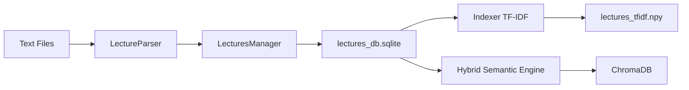

# 🏛️ نظرة عامة على الباك اند (Backend Overview)

توفر هذه الوثيقة خريطة طريق تقنية لمنظومة "حسين" المعرفية، موضحة كيفية ترابط المحركات والبيانات لخدمة الاستعلامات الدلالية.

## 🧱 بنية النظام (System Architecture)

تعتمد المنظومة على عمارة **هجينة (Hybrid Architecture)** تدمج بين البحث النصي التقليدي (TF-IDF) والبحث الدلالي العصبي (Sentence-Transformers).

### 🔄 مخطط تدفق البيانات (Data Pipeline)

## 📂 خريطة المكونات الرئيسية

| المكون | الوصف الوظيفي |
|--------|----------------|
| `lecture_parser.py` | المحرك المسؤول عن تحليل النصوص الخام واستخراج البيانات الوصفية والفقرات. |
| `lectures_manager.py` | مدير قاعدة البيانات المسؤول عن عمليات الـ CRUD والـ Batch Processing. |
| `lectures_indexer.py` | أداة بناء فهرس المتجهات النصية (TF-IDF) باستخدام NumPy. |
| `hybrid_search.py` | محرك البحث الدلالي الرئيسي الذي يربط الأنطولوجيا بالقرآن الكريم. |
| `lectures_query.py` | واجهة برمجة التطبيقات (Internal API) لاستعادة الفقرات وسياقاتها. |

## ⚙️ بيئة التشغيل (Environment)
تعتمد المنظومة على بيئة Python 3.10+ مع المكتبات التالية:
- `sentence-transformers`: للحوسبة الدلالية.
- `chromadb`: كقاعدة بيانات متجهة (Vector DB).
- `sqlite3`: لتخزين البيانات العلائقية.
- `numpy`: للعمليات الحسابية السريعة (TF-IDF).

---

> [!TIP]
> جميع السكربتات تدعم ترميز **UTF-8** بشكل كامل لضمان دقة معالجة اللغة العربية.

---

### الانتقال إلى:
- [📖 هندسة البيانات والمعالجة](DATA_PIPELINE.md)
- [🔍 محركات البحث والاستعلام](SEARCH_ENGINE.md)
- [🗄️ مرجع قاعدة البيانات](DATABASE_REFERENCE.md)
