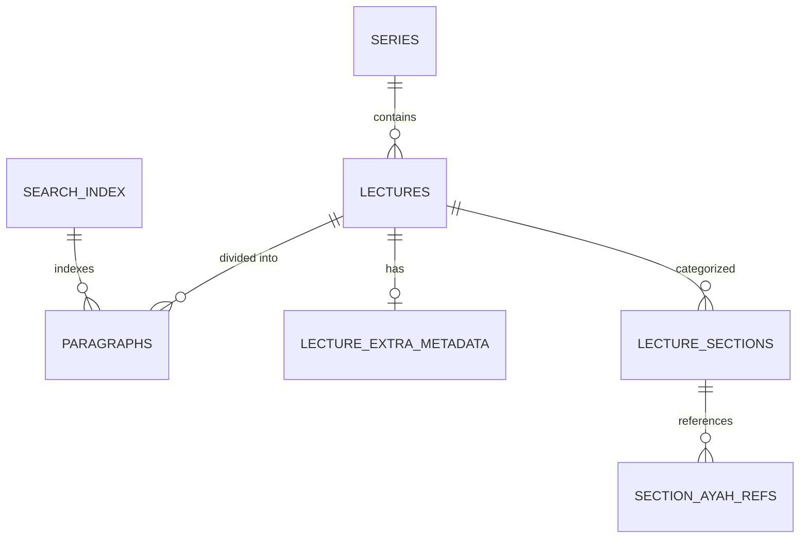

# 🗄️ مرجع قاعدة البيانات (Database Reference)

تعتمد المنظومة على قاعدة بيانات SQLite (`lectures_db.sqlite`) مركزية، مصممة بهيكلية علائقية قوية لضمان الارتباط المعرفي السلس.

## 📐 مخطط الجداول (Entity Relationship Schema)

## 📋 تفاصيل الجداول

### 1. `series` (السلاسل)
تخزين السلاسل الرئيسية للدروس.
- `series_id`: معرف فريد (UUID).
- `title`: اسم السلسلة (مثل: معرفة الله).

### 2. `lectures` (الدروس)
السجل المركزي لكل درس.
- `lecture_id`: معرف فريد.
- `series_id`: ربط بالسلسلة.
- `title`: عنوان الدرس.
- `metadata_json`: بيانات تقنية إضافية (مثل اسم الملف الأصلي).

### 3. `paragraphs` (الفقرات)
أصغر وحدة نصية قابلة للاسترجاع.
- `paragraph_id`: معرف فريد.
- `sequence_index`: الترتيب التسلسلي داخل الدرس.
- `content`: النص الكامل للفقرة.
- `contains_ayat`: علامة (Boolean) بوجود آيات.

### 4. `lecture_sections` (الأقسام الموضوعية)
التقسيم الموضوعي الذكي للدروس.
- `section_id`: معرف القسم.
- `section_title`: اسم الموضوع.
- `concepts_tags`: وسم دلالي (JSON Tags).
- `start_paragraph_id` / `end_paragraph_id`: النطاق النصي للقسم.

### 5. `section_ayah_refs` (إشارات الآيات)
ربط الأقسام بالآيات القرآنية.
- `surah_name`: اسم السورة المعياري.
- `ayah_number`: رقم الآية.

### 6. `lecture_extra_metadata` (البيانات الإضافية)
- `date_hijri` / `date_gregorian`: التواريخ.
- `location`: مكان إلقاء الدرس.

---

> [!NOTE]
> يتميز جدول `search_index` بتخزين القاموس (Vocab) وترتيب النطاقات (Para IDs) لضمان سرعة البحث النصي دون إعادة حساب القيم في كل مرة.

---

### الانتقال إلى:
- [🏛️ نظرة عامة على الباك اند](BACKEND_OVERVIEW.md)
- [📖 هندسة البيانات والمعالجة](DATA_PIPELINE.md)
- [🔍 محركات البحث والاستعلام](SEARCH_ENGINE.md)
