# 📋 وثيقة المتطلبات الفنية الشاملة
## منظومة HUSSAIN — التطبيقات المقترحة

**الإصدار:** 1.0 | **التاريخ:** 2026-03-30  
**المؤلف:** فريق منظومة HUSSAIN

---

## فهرس الوثائق

| التطبيق | الاختصار | الأولوية | الصفحة |
|---|---|---|---|
| [HUSSAIN Scholar](#app-1) | HS | 🔴 P0 | §1 |
| [رفيق الدرس](#app-3) | RD | 🔴 P0 | §2 |
| [المرشد الفكري](#app-4) | MF | 🟡 P1 | §3 |
| [المخيلة المعرفية](#app-2) | MM | 🟡 P1 | §4 |
| [المصحف الذكي](#app-6) | MZ | 🟢 P2 | §5 |
| [لوحة الاستكشاف](#app-5) | LA | 🟢 P2 | §6 |

---

---

# <a id="app-1"></a>§1 — HUSSAIN Scholar

## 1.1 نظرة عامة

| الخاصية | القيمة |
|---|---|
| **النوع** | Web App (PWA) |
| **الجمهور المستهدف** | باحثون، طلاب دراسات إسلامية، مثقفون |
| **الوصف** | محرك بحث دلالي هجين يُجيب على استعلامات اللغة الطبيعية بنتائج من الأنطولوجيا والدروس والقرآن |
| **الأولوية** | 🔴 P0 — الأساس الذي تنبني عليه باقي التطبيقات |

---

## 1.2 حالات الاستخدام (Use Cases)

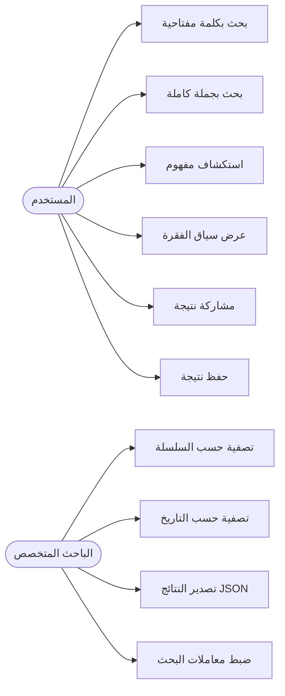

### حالات الاستخدام التفصيلية

| UC# | العنوان | المحفز | التدفق الرئيسي | نتيجة البحث |
|---|---|---|---|---|
| UC-01 | بحث دلالي | المستخدم يكتب نصاً | إدخال → معالجة → نتائج ثلاثية | نتائج من 3 مصادر |
| UC-02 | استكشاف مفهوم | نقر على مفهوم في النتيجة | فتح صفحة المفهوم | شبكة روابط المفهوم |
| UC-03 | قراءة سياق | نقر "السياق الكامل" | عرض الفقرات المحيطة | ٥ فقرات حول النتيجة |
| UC-04 | مشاركة | نقر "مشاركة" | توليد رابط أو صورة | رابط مباشر / صورة PNG |
| UC-05 | تصفية | نقر Filters | اختيار السلسلة/النوع | نتائج مُصفَّاة |

---

## 1.3 المتطلبات الوظيفية (Functional Requirements)

### FR-01: واجهة البحث
- [ ] **FR-01-1:** قبول نص عربي بحد أقصى 500 حرف
- [ ] **FR-01-2:** اقتراحات فورية بعد 2 ثانية من التوقف عن الكتابة
- [ ] **FR-01-3:** حفظ آخر 20 استعلام في LocalStorage
- [ ] **FR-01-4:** دعم البحث بـ Enter أو زر البحث

### FR-02: نظام النتائج الثلاثية
- [ ] **FR-02-1:** عرض نتيجة دلالية من الأنطولوجيا (ChromaDB)
- [ ] **FR-02-2:** عرض آية/آيات مرتبطة (Hard-link أو Semantic Fallback)
- [ ] **FR-02-3:** عرض أفضل 5 فقرات من الدروس (TF-IDF)
- [ ] **FR-02-4:** عرض نسبة التطابق لكل نتيجة (%)
- [ ] **FR-02-5:** ترتيب النتائج حسب درجة الملاءمة

### FR-03: التصفية والفرز
- [ ] **FR-03-1:** تصفية حسب السلسلة (7 سلاسل)
- [ ] **FR-03-2:** تصفية حسب نوع النتيجة (أنطولوجيا / درس / قرآن)
- [ ] **FR-03-3:** فرز حسب: الأعلى تطابقاً / الأحدث
- [ ] **FR-03-4:** خيار تضييق/توسيع عدد النتائج (3 / 5 / 10)

### FR-04: صفحة النتيجة التفصيلية
- [ ] **FR-04-1:** عرض النص الكامل للفقرة مع تمييز مصطلح البحث
- [ ] **FR-04-2:** عرض الفقرات المحيطة (±2 فقرة)
- [ ] **FR-04-3:** بيانات الدرس: الاسم، السلسلة، رقم الدرس
- [ ] **FR-04-4:** روابط للمفاهيم المرتبطة من الأنطولوجيا

---

## 1.4 المتطلبات غير الوظيفية (Non-Functional Requirements)

| المتطلب | المعيار |
|---|---|
| **الأداء** | نتائج خلال ≤ 2 ثانية لـ 95% من الاستعلامات |
| **التوافر** | 99.5% uptime |
| **التزامن** | دعم 100 مستخدم في نفس الوقت |
| **الاستجابة** | يعمل على: desktop, tablet, mobile |
| **RTL** | 100% دعم اليمين لليسار |
| **الأمان** | HTTPS إجباري، rate limiting (60 req/min/IP) |
| **SEO** | SSR من خلال Next.js |

---

## 1.5 المعمارية التقنية

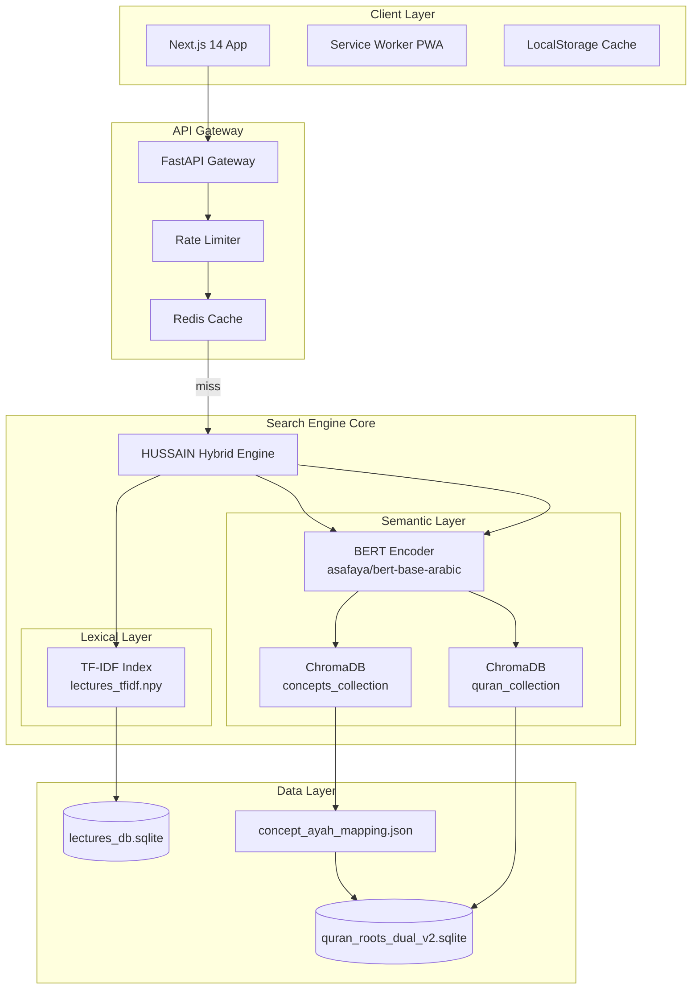

---

## 1.6 تدفق البيانات (Data Flow)

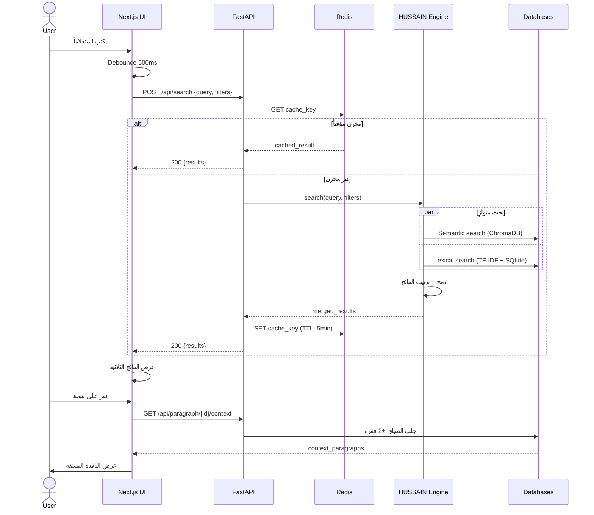

---

## 1.7 مواصفات API

### `POST /api/v1/search`

**Request:**
```json
{
  "query": "الخسارة الحقيقية للإنسان",
  "top_k": 5,
  "filters": {
    "sources": ["ontology", "lectures", "quran"],
    "series": ["سلسلة دروس رمضان"],
    "min_score": 0.3
  }
}
```

**Response:**
```json
{
  "query": "الخسارة الحقيقية للإنسان",
  "processing_time_ms": 847,
  "results": {
    "ontology": {
      "concept_id": "uuid",
      "concept_name": "الخسارة الحقيقية",
      "definition": "...",
      "score": 0.89,
      "linked_ayahs": [103]
    },
    "quran": [
      {
        "global_ayah": 103,
        "surah_no": 103,
        "ayah_no": 1,
        "text": "﴿وَالْعَصْرِ﴾",
        "roots": [{"token": "العصر", "root": "ع-ص-ر"}],
        "match_type": "hard_link",
        "score": 1.0
      }
    ],
    "lectures": [
      {
        "paragraph_id": "uuid",
        "content": "...",
        "lecture_title": "الدرس الثالث",
        "series_title": "سلسلة دروس رمضان",
        "score": 0.74,
        "contains_ayat": true
      }
    ]
  }
}
```

### `GET /api/v1/paragraph/{id}/context`

**Response:**
```json
{
  "target_paragraph_id": "uuid",
  "context": [
    {"sequence_index": 14, "content": "...", "is_target": false},
    {"sequence_index": 15, "content": "...", "is_target": true},
    {"sequence_index": 16, "content": "...", "is_target": false}
  ],
  "lecture": {"title": "...", "series": "...", "speaker": "..."}
}
```

---

---

# <a id="app-3"></a>§2 — رفيق الدرس (Lecture Companion)

## 2.1 نظرة عامة

| الخاصية | القيمة |
|---|---|
| **النوع** | PWA + Mobile-First |
| **الجمهور المستهدف** | المتعلم اليومي، من يريد قراءة منتظمة |
| **الوصف** | تطبيق قراءة مركّزة للدروس مع ربط الآيات تلقائياً وإمكانية التعليق والحفظ |
| **الأولوية** | 🔴 P0 |

---

## 2.2 حالات الاستخدام

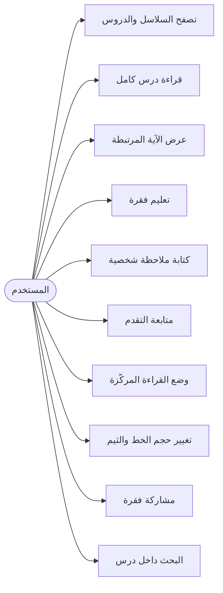

---

## 2.3 المتطلبات الوظيفية

### FR-01: مكتبة الدروس
- [ ] عرض 7 سلاسل كـ بطاقات مميزة
- [ ] عرض الدروس ضمن كل سلسلة مع شريط التقدم
- [ ] الدرس مكتمل / قيد القراءة / لم يُبدأ

### FR-02: قارئ الدروس
- [ ] عرض الفقرات تسلسلياً مع ترقيم
- [ ] **الإضاءة الذهبية:** كل فقرة تحتوي `contains_ayat=true` تُحاط بهالة ذهبية
- [ ] نقر الهالة → نافذة منبثقة بالآية الكاملة + جذورها
- [ ] تمييز آخر موضع قراءة تلقائياً (Bookmark التلقائي)

### FR-03: الميزة الاجتماعية / الشخصية
- [ ] تمييز فقرة باللون (أصفر / أخضر / أحمر)
- [ ] كتابة ملاحظة على فقرة محددة
- [ ] حفظ المفضلة عبر IndexedDB (بدون حساب)

### FR-04: تخصيص القراءة
- [ ] 3 أحجام خط: صغير / متوسط / كبير
- [ ] 3 ثيمات: ليلي / نهاري / بني كلاسيكي
- [ ] عرض/إخفاء أرقام الفقرات

---

## 2.4 المعمارية التقنية

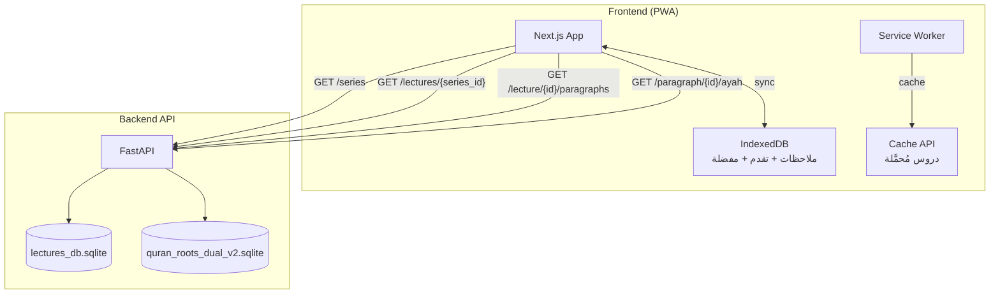

---

## 2.5 تدفق القراءة

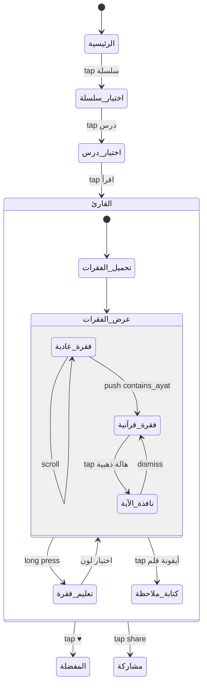

---

## 2.6 نموذج البيانات المحلية (IndexedDB)

```typescript
// schema: IndexedDB stores
interface ReadingProgress {
  lectureId: string;
  lastParagraphIndex: number;
  completedAt?: Date;
  percentage: number;
}

interface Annotation {
  id: string;
  paragraphId: string;
  lectureId: string;
  color: 'yellow' | 'green' | 'red';
  note?: string;
  createdAt: Date;
}

interface Bookmark {
  id: string;
  paragraphId: string;
  lectureId: string;
  seriesTitle: string;
  excerpt: string;
  createdAt: Date;
}
```

---

---

# <a id="app-4"></a>§3 — المرشد الفكري (AI Scholarly Assistant)

## 3.1 نظرة عامة

| الخاصية | القيمة |
|---|---|
| **النوع** | Chat Interface + RAG Pipeline |
| **الجمهور المستهدف** | المستخدم العام — يريد فهماً عميقاً |
| **الوصف** | واجهة محادثة تعتمد على LLM مع HUSSAIN كمصدر RAG للإجابة الموثّقة |
| **الأولوية** | 🟡 P1 |

---

## 3.2 حالات الاستخدام

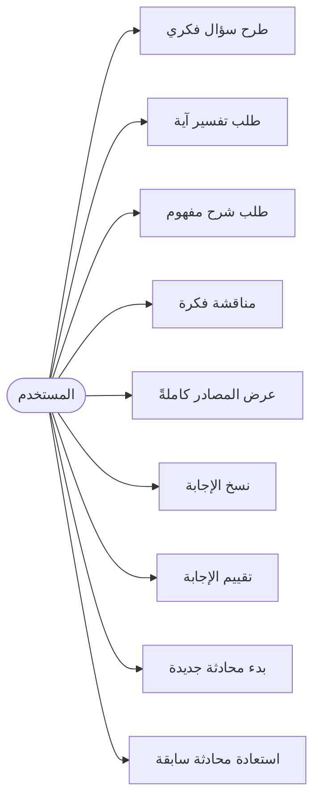

---

## 3.3 معمارية RAG Pipeline

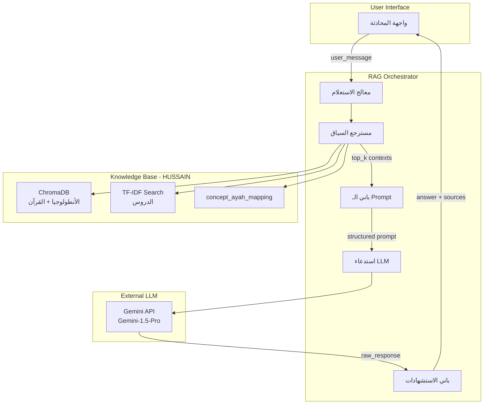

---

## 3.4 هيكل الـ Prompt

```
SYSTEM PROMPT:
═══════════════════════════════════════
أنت مرشد فكري متخصص في فكر السيد حسين بدر الدين الحوثي
والدراسات القرآنية. أجب فقط بناءً على السياق المُقدَّم.
اذكر المصدر بدقة. إذا لم يكن في السياق، قل "لم أجد في المصادر المتاحة".
لا تُبدع ولا تُكمل من خيالك.
═══════════════════════════════════════

CONTEXT (مُسترجَع من HUSSAIN):
─────────────────────────
[CONCEPT]: {concept_name} — {definition}
[AYAH]: ﴿{ayah_text}﴾ [{surah}:{ayah_no}]
[LECTURE_EXCERPT_1]: "{paragraph_content}" 
  ← المصدر: {series_title} / {lecture_title}
[LECTURE_EXCERPT_2]: "{paragraph_content}"
  ← المصدر: {series_title} / {lecture_title}
─────────────────────────

USER QUESTION: {user_message}

FORMAT:
- ابدأ بالإجابة المباشرة
- استشهد بالنص الحرفي بين علامتَي اقتباس
- اذكر المصادر في نهاية الإجابة بصيغة: [⟵ المصدر: ...]
```

---

## 3.5 تدفق المحادثة

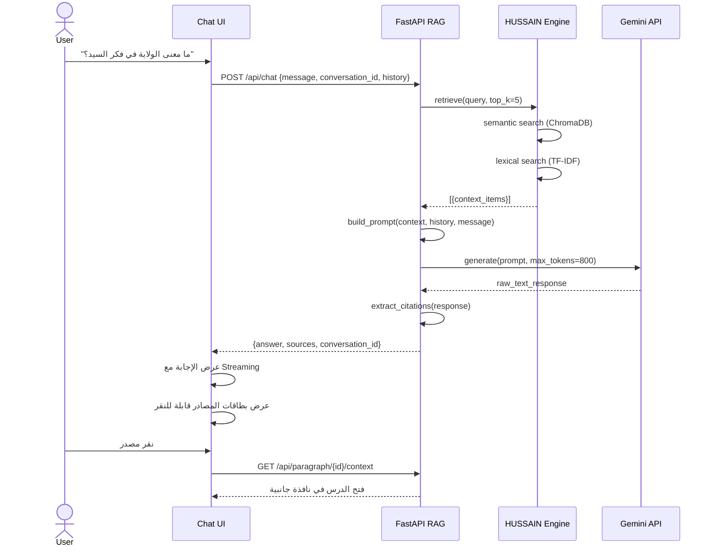

---

## 3.6 مواصفات API

### `POST /api/v1/chat`

**Request:**
```json
{
  "message": "ما معنى الولاية في فكر السيد؟",
  "conversation_id": "uuid-or-null",
  "history": [
    {"role": "user", "content": "..."},
    {"role": "assistant", "content": "..."}
  ],
  "options": {
    "max_sources": 3,
    "include_quran": true,
    "stream": true
  }
}
```

**Response (Stream):**
```json
// SSE stream chunks:
data: {"chunk": "الولاية في فكر السيد", "type": "text"}
data: {"chunk": " تُمثّل...", "type": "text"}
data: {"type": "sources", "sources": [
  {"type": "lecture", "paragraph_id": "uuid", "excerpt": "...", "series": "...", "score": 0.87},
  {"type": "quran", "global_ayah": 60, "text": "﴿...﴾", "surah": 5}
]}
data: {"type": "done"}
```

---

## 3.7 حدود ومحاذير النظام

> [!CAUTION]
> **التحذيرات الأخلاقية والتقنية**
> - النظام يُجيب فقط من مصادر HUSSAIN — لا اجتهاد خارجها
> - تحذير واضح للمستخدم: "الإجابات مبنية على مصادر المشروع وليست فتوى أو رأياً دينياً رسمياً"
> - حد معدل الاستخدام: 20 رسالة / 10 دقائق / مستخدم

---

---

# <a id="app-2"></a>§4 — المخيلة المعرفية (Knowledge Graph Explorer)

## 4.1 نظرة عامة

| الخاصية | القيمة |
|---|---|
| **النوع** | Interactive Web Visualization |
| **الجمهور المستهدف** | الباحث الأكاديمي، المفكر |
| **الوصف** | خريطة مرئية تفاعلية للأنطولوجيا — كل مفهوم عقدة، والعلاقات بينها خطوط مضيئة |
| **الأولوية** | 🟡 P1 |

---

## 4.2 حالات الاستخدام

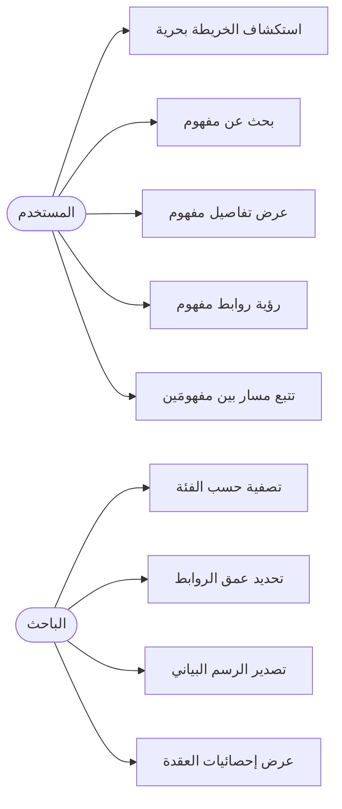

---

## 4.3 معمارية المكونات

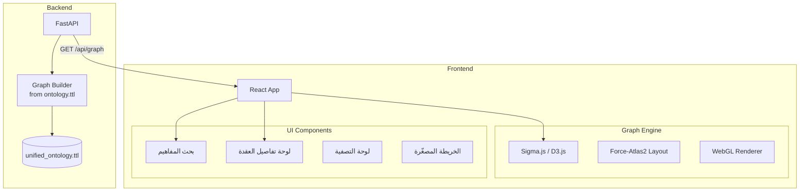

---

## 4.4 هيكل بيانات الجراف

```typescript
interface GraphData {
  nodes: Node[];
  edges: Edge[];
  metadata: {
    total_concepts: number;
    total_relations: number;
    categories: string[];
  };
}

interface Node {
  id: string;           // concept_id
  label: string;        // concept_name
  category: string;     // الفئة الكبرى
  definition: string;
  size: number;         // عدد الروابط → حجم العقدة
  color: string;        // لون الفئة
  linked_ayahs: number[];
  lecture_count: number;
}

interface Edge {
  id: string;
  source: string;       // concept_id
  target: string;       // concept_id
  relation_type: string; // "يشمل" / "مرتبط بـ" / "ضد"
  weight: number;       // قوة العلاقة
}
```

---

## 4.5 تدفق "المسار الفكري" (Path Finding)

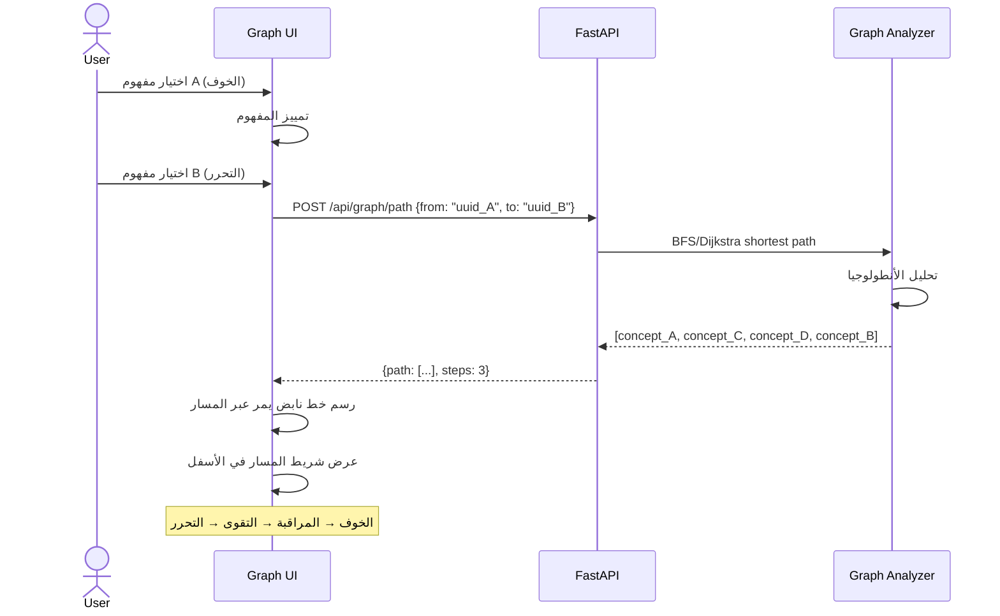

---

## 4.6 API الجراف

### `GET /api/v1/graph`
```json
// Response
{
  "nodes": [...],
  "edges": [...],
  "generated_at": "2026-03-30T..."
}
```

### `GET /api/v1/graph/node/{concept_id}`
```json
{
  "concept": {"id": "...", "name": "...", "definition": "..."},
  "relations": [
    {"target": "...", "type": "يشمل", "weight": 0.8}
  ],
  "linked_ayahs": [...],
  "lecture_excerpts": [...]
}
```

### `POST /api/v1/graph/path`
```json
// Request
{"from": "concept_uuid_a", "to": "concept_uuid_b"}

// Response
{
  "path": ["uuid_a", "uuid_c", "uuid_d", "uuid_b"],
  "labels": ["الخوف", "المراقبة", "التقوى", "التحرر"],
  "steps": 3,
  "found": true
}
```

---

---

# <a id="app-6"></a>§5 — المصحف الذكي (Smart Quran Interface)

## 5.1 نظرة عامة

| الخاصية | القيمة |
|---|---|
| **النوع** | Standalone Web App |
| **الجمهور المستهدف** | قارئ القرآن + الباحث |
| **الوصف** | عرض القرآن مع طبقة HUSSAIN — كل آية تحمل إمكانية الاطلاع على ما قاله السيد عنها |
| **الأولوية** | 🟢 P2 |

---

## 5.2 حالات الاستخدام

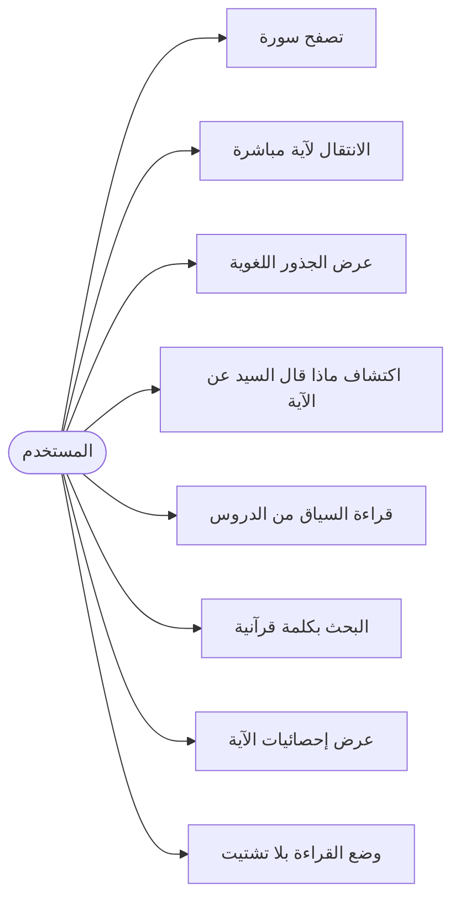

---

## 5.3 المعمارية التقنية

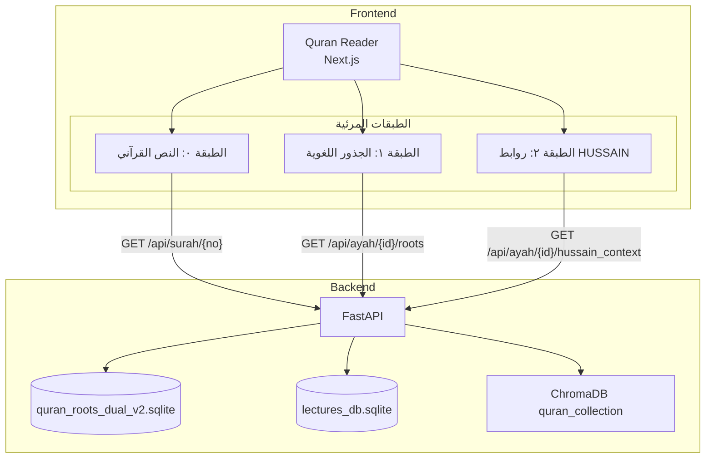

---

## 5.4 تدفق اكتشاف سياق HUSSAIN للآية

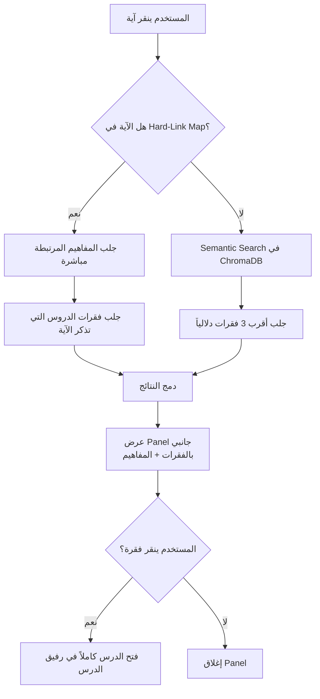

---

## 5.5 مواصفات API

### `GET /api/v1/surah/{surah_no}`
```json
{
  "surah_no": 5,
  "name_arabic": "المائدة",
  "total_ayahs": 120,
  "ayahs": [
    {
      "global_ayah": 580,
      "ayah_no": 1,
      "text_uthmani": "﴿يَا أَيُّهَا الَّذِينَ آمَنُوا...﴾",
      "has_hussain_context": true,
      "hussain_context_count": 3
    }
  ]
}
```

### `GET /api/v1/ayah/{global_ayah}/hussain_context`
```json
{
  "ayah": {"text": "...", "surah_no": 5, "ayah_no": 51},
  "roots": [{"token": "أَوْلِيَاءَ", "root": "و-ل-ي"}],
  "hussain_context": {
    "linked_concepts": [
      {"name": "الولاية", "definition": "...", "match": "hard_link"}
    ],
    "lecture_excerpts": [
      {
        "paragraph_id": "uuid",
        "content": "...",
        "lecture_title": "...",
        "series_title": "...",
        "relevance_score": 0.91
      }
    ]
  }
}
```

---

---

# <a id="app-5"></a>§6 — لوحة الاستكشاف (Analytics Dashboard)

## 6.1 نظرة عامة

| الخاصية | القيمة |
|---|---|
| **النوع** | Data Visualization Dashboard |
| **الجمهور المستهدف** | الباحث الأكاديمي / مطور المشروع |
| **الوصف** | لوحة بيانات تحليلية تستعرض إحصائيات المشروع، شبكات المفاهيم، وأنماط الارتباط |
| **الأولوية** | 🟢 P2 |

---

## 6.2 مخطط مكونات اللوحة

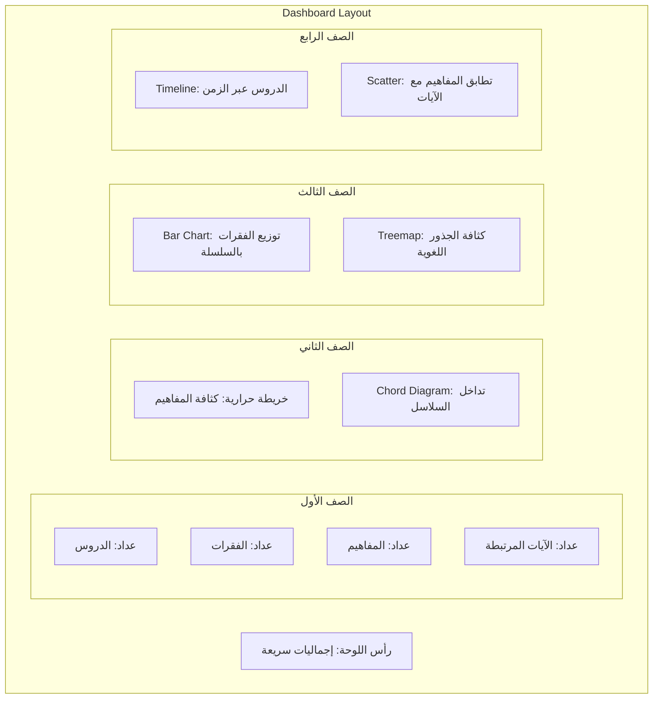

---

## 6.3 حالات الاستخدام

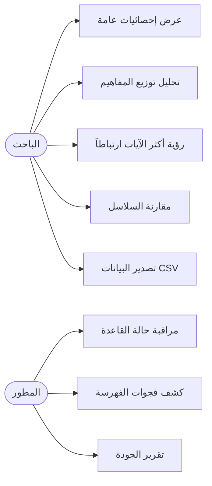

---

## 6.4 API التحليلات

### `GET /api/v1/analytics/overview`
```json
{
  "totals": {
    "series": 7,
    "lectures": 86,
    "paragraphs": 11883,
    "concepts": 1247,
    "quran_ayahs_linked": 423,
    "unique_roots": 3812
  },
  "last_updated": "2026-03-30T..."
}
```

### `GET /api/v1/analytics/concepts/top`
```json
{
  "top_concepts": [
    {
      "name": "الإيمان",
      "ayah_links": 234,
      "lecture_mentions": 456,
      "series_distribution": {
        "معرفة الله": 180,
        "مديح القرآن": 90
      }
    }
  ]
}
```

### `GET /api/v1/analytics/series/comparison`
```json
{
  "series": [
    {
      "title": "سلسلة دروس رمضان",
      "lectures": 26,
      "paragraphs": 4230,
      "avg_paragraphs_per_lecture": 162.7,
      "concepts_mentioned": 340,
      "ayahs_linked": 87
    }
  ]
}
```

---

---

# القسم المشترك: الـ API الموحّد

## الـ Backend الموحّد وتوزيع الـ Endpoints

```mermaid
graph LR
    subgraph "Applications"
        HS[HUSSAIN Scholar]
        RD[رفيق الدرس]
        MF[المرشد الفكري]
        MM[المخيلة المعرفية]
        MZ[المصحف الذكي]
        LA[لوحة الاستكشاف]
    end

    subgraph "FastAPI — Unified Backend"
        direction TB
        
        SR[/api/v1/search]
        CH[/api/v1/chat]
        LC[/api/v1/lectures]
        PR[/api/v1/paragraphs]
        QR[/api/v1/quran]
        GR[/api/v1/graph]
        AN[/api/v1/analytics]
    end

    HS --> SR
    HS --> PR
    
    RD --> LC
    RD --> PR
    RD --> QR
    
    MF --> CH
    MF --> SR
    
    MM --> GR
    
    MZ --> QR
    MZ --> PR
    
    LA --> AN
    LA --> GR
```

---

## بنية المشروع الكاملة المقترحة

```
hussain-platform/
│
├── backend/                    ← FastAPI Unified API
│   ├── api/
│   │   ├── routes/
│   │   │   ├── search.py       ← /api/v1/search
│   │   │   ├── chat.py         ← /api/v1/chat (RAG)
│   │   │   ├── lectures.py     ← /api/v1/lectures
│   │   │   ├── paragraphs.py   ← /api/v1/paragraphs
│   │   │   ├── quran.py        ← /api/v1/quran
│   │   │   ├── graph.py        ← /api/v1/graph
│   │   │   └── analytics.py    ← /api/v1/analytics
│   │   └── middleware/
│   │       ├── rate_limiter.py
│   │       └── cache.py
│   ├── core/
│   │   ├── hussain_engine.py   ← محرك HUSSAIN الحالي
│   │   ├── rag_pipeline.py     ← RAG للمرشد الفكري
│   │   └── graph_builder.py    ← بناء الجراف من TTL
│   ├── data/                   ← قواعد البيانات
│   └── main.py
│
├── apps/
│   ├── scholar/                ← HUSSAIN Scholar (Next.js)
│   ├── companion/              ← رفيق الدرس (Next.js PWA)
│   ├── guide/                  ← المرشد الفكري (Next.js)
│   ├── explorer/               ← المخيلة المعرفية (React + D3)
│   ├── quran/                  ← المصحف الذكي (Next.js)
│   └── dashboard/              ← لوحة الاستكشاف (React)
│
└── packages/
    ├── ui/                     ← مكتبة مكونات مشتركة
    ├── api-client/             ← TypeScript API Client
    └── design-tokens/          ← ألوان + خطوط مشتركة
```

---

## معايير القبول العامة (Definition of Done)

```
لكل تطبيق، لا يُعتبر مكتملاً إلا عند:

✅ يعمل على Chrome + Firefox + Safari
✅ متجاوب بالكامل (320px → 1920px)
✅ RTL صحيح 100% بدون كسر تخطيط
✅ نسبة تباين Accessibility ≥ AA (WCAG 2.1)
✅ اختبارات API: 100% coverage للـ routes الأساسية
✅ وقت التحميل الأولي ≤ 3 ثوانٍ (LCP)
✅ يعمل بدون JavaScript (SSR للمحتوى الأساسي)
✅ موثّق في README بمثال استخدام واحد على الأقل
```

---

*وثيقة المتطلبات الفنية — منظومة HUSSAIN | v1.0 | 2026-03-30*
